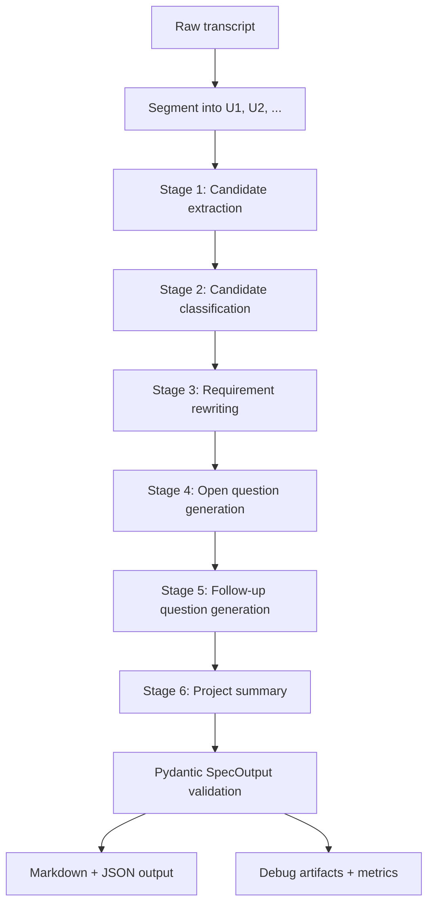

# Conversation-to-Spec

> Turn messy client-developer conversations into traceable software requirement drafts.

**Conversation-to-Spec** is a Python-only NLP prototype for converting informal English project conversations into structured software specification drafts. It is built for junior PMs, student team leads, and capstone teams who need to identify requirements, ambiguity, constraints, and follow-up questions before implementation starts.

This is **not a web app**. The project focuses on local Hugging Face model inference, prompt-chained LLM processing, schema validation, quantitative evaluation, model comparison, and experiment logging.

---

## What It Produces

Given a plain `.txt` conversation, the system generates:

- `output/spec.json`: validated structured output
- `output/spec.md`: readable requirements draft
- `output/debug/<input-name>/`: raw model outputs, repaired outputs, stage errors, and run summary

The final spec contains:

| Section | Purpose |
| --- | --- |
| `project_summary` | Short project-level summary grounded in the conversation |
| `functional_requirements` | Concrete user/system capabilities |
| `non_functional_requirements` | Quality attributes such as usability, reliability, speed, accessibility, style, and security |
| `constraints` | Explicit scope, deadline, platform, role, budget, or access limits |
| `open_questions` | Unresolved ambiguity or missing decisions |
| `follow_up_questions` | Developer-facing questions that should be asked next |
| `notes` | Useful contextual information that is not a hard requirement |
| `conversation_units` | Trace units `U1`, `U2`, ... used as evidence anchors |
| `verification_warnings` | Semantic consistency warnings from post-generation checks |

Every extracted item carries `source_units`, so a reviewer can trace each requirement back to the original conversation unit.

---

## Current Pipeline

The default architecture is a **multi-stage LLM chain** rather than a single generic summary prompt.



The chain is designed to make the model do the NLP-heavy work:

1. **Segment** raw text into traceable conversation units.
2. **Extract candidates** with high recall.
3. **Classify candidates** into requirement categories.
4. **Rewrite** raw utterances into specification-style wording.
5. **Generate open questions** for unresolved ambiguity.
6. **Generate follow-up questions** only where clarification is still needed.
7. **Validate** the final result with Pydantic.
8. **Evaluate** outputs quantitatively against a manually labeled dataset.

A `single_shot` mode also exists for controlled comparison against the chained architecture.

---

## Requirements

- Python `>=3.10`
- macOS, Linux, or Windows
- Hugging Face Transformers-compatible local inference environment
- GPU strongly recommended for 1B+ models

The project currently uses `uv` for reproducible dependency management.

Main dependencies are declared in [pyproject.toml](pyproject.toml):

- `transformers`
- `torch`
- `accelerate`
- `pydantic`
- `PyYAML`
- `matplotlib`

Windows CUDA builds use the configured PyTorch CUDA index in `pyproject.toml`.

---

## Setup

### Recommended: uv

```bash
uv sync
```

Run commands through the virtual environment:

```bash
uv run python -m app.main --help
```

### Alternative: pip

```bash
python3 -m venv .venv
source .venv/bin/activate  # macOS/Linux
pip install -r requirements.txt
```

On Windows PowerShell:

```powershell
python -m venv .venv
.\.venv\Scripts\Activate.ps1
pip install -r requirements.txt
```

---

## Quick Start

### Run with the default model

The default model is configured in [configs/models.yaml](configs/models.yaml):

```yaml
default_model: qwen2_5_3b_instruct
```

Run a sample transcript:

```bash
uv run python -m app.main \
  --input samples/sample_cafe_website.txt \
  --output output
```

Equivalent without `uv`:

```bash
python3 -m app.main --input samples/sample_cafe_website.txt --output output
```

### Run with a specific model alias

```bash
uv run python -m app.main \
  --input samples/sample_club_app.txt \
  --output output \
  --model qwen2_5_3b_instruct
```

### Run with a direct Hugging Face repo id

```bash
uv run python -m app.main \
  --input samples/sample_restaurant.txt \
  --output output \
  --model Qwen/Qwen2.5-1.5B-Instruct
```

### Run deterministic mock mode

Mock mode is useful for tests and CLI validation without downloading model weights.

```bash
uv run python -m app.main \
  --input samples/sample_cafe_website.txt \
  --output output \
  --mock
```

---

## Model Configuration

Model aliases live in [configs/models.yaml](configs/models.yaml).

Current configured models include:

| Alias | Hugging Face model |
| --- | --- |
| `qwen_0_5b` | `Qwen/Qwen2.5-0.5B-Instruct` |
| `qwen_1_5b` | `Qwen/Qwen2.5-1.5B-Instruct` |
| `qwen2_5_3b_instruct` | `Qwen/Qwen2.5-3B-Instruct` |
| `tinyllama_1_1b` | `TinyLlama/TinyLlama-1.1B-Chat-v1.0` |
| `gemma_3_1b_it` | `google/gemma-3-1b-it` |
| `phi_3_5_mini_instruct` | `microsoft/Phi-3.5-mini-instruct` |
| `mistral_7b_instruct` | `mistralai/Mistral-7B-Instruct-v0.3` |

Shared generation settings are also configured in `configs/models.yaml`:

```yaml
generation:
  max_new_tokens: 900
  temperature: 0.0
  top_p: 1.0
  do_sample: false
  max_retries: 2
```

---

## Pipeline Modes and Robustness Profiles

### Pipeline modes

| Mode | Description |
| --- | --- |
| `chain` | Multi-stage extraction, classification, rewriting, question generation, and summary generation |
| `single_shot` | One prompt directly generates the full `SpecOutput` |

Example:

```bash
uv run python -m app.main \
  --input samples/sample_cafe_website.txt \
  --output output \
  --model qwen2_5_3b_instruct \
  --pipeline-mode single_shot
```

### Robustness profiles

| Profile | Repair | Retry | Stage fallback | Semantic verification | Use case |
| --- | --- | --- | --- | --- | --- |
| `FullChain` | yes | yes | yes | yes | Default robust pipeline |
| `NoRetry` | yes | no | yes | yes | Retry ablation |
| `NoSemanticVerify` | yes | yes | yes | no | Verification ablation |
| `StrictRaw` | no | no | no | no | Strict model-only failure analysis |

Example strict run:

```bash
uv run python -m app.main \
  --input samples/sample_club_app.txt \
  --output output \
  --model qwen2_5_3b_instruct \
  --ablation-profile StrictRaw
```

If you want the model output to fail rather than be rescued by deterministic stage fallback, use `--ablation-profile StrictRaw`.

---

## Evaluation

The evaluation dataset is [dataset/eval_samples.json](dataset/eval_samples.json). It contains manually labeled gold items for:

- functional requirements
- non-functional requirements
- constraints
- open questions
- follow-up questions
- notes
- evidence/source-unit links

### Evaluate one model

```bash
uv run python -m app.main \
  --evaluate \
  --dataset dataset/eval_samples.json \
  --model qwen2_5_3b_instruct
```

Outputs are written under:

```text
eval_output/<model>__<pipeline-mode>/
```

### Compare configured models

```bash
uv run python -m app.main \
  --evaluate \
  --dataset dataset/eval_samples.json \
  --all-models
```

Comparison outputs:

- `eval_output/comparison_results.json`
- `eval_output/comparison_table.md`
- per-model `metrics.json`
- per-sample prediction/debug files

### Timestamped experiment run

```bash
uv run python -m app.main \
  --evaluate \
  --dataset dataset/eval_samples.json \
  --model qwen2_5_3b_instruct \
  --experiment
```

Artifacts are stored under:

```text
experiments/runs/<timestamp>/
```

### Predefined experiment suites

RQ2 compares chain vs single-shot:

```bash
uv run python -m app.main \
  --experiment-suite rq2 \
  --dataset dataset/eval_samples.json \
  --model qwen2_5_3b_instruct \
  --experiment
```

RQ4 runs robustness ablations:

```bash
uv run python -m app.main \
  --experiment-suite rq4 \
  --dataset dataset/eval_samples.json \
  --model qwen2_5_3b_instruct \
  --experiment
```

---

## Metrics

The evaluator reports both extraction quality and operational reliability.

| Metric | Meaning |
| --- | --- |
| Functional / non-functional / constraint F1 | Exact or normalized match against gold items |
| Requirement type macro-F1 | Whether extracted items were placed in the correct category |
| Open question recall | How many gold ambiguity/open-question items were captured |
| Follow-up question coverage | Whether unresolved issues triggered useful follow-up questions |
| Hallucination rate | Predicted items not supported by any gold item |
| Schema validity rate | JSON parse + Pydantic validation success |
| Usable output rate | Whether the pipeline produced a final usable spec |
| Retry recovery rate | Fraction of samples recovered by retry |
| Fallback rescue rate | Fraction of samples rescued by deterministic stage fallback |
| Semantic warning rate | Fraction of outputs flagged by semantic verification |
| Average latency | Mean runtime per sample |

Important limitation: exact-match F1 is intentionally strict and may under-score semantically correct paraphrases. The final report therefore also discusses artifact-level semantic rescoring.

---

## Project Structure

```text
conversation-to-spec/
├── app/
│   ├── main.py              # CLI entry point
│   ├── segmenter.py         # transcript segmentation into U1, U2, ...
│   ├── schemas.py           # Pydantic output and stage schemas
│   ├── prompt_builder.py    # prompt construction for each LLM stage
│   ├── model_runner.py      # HF and mock model runners
│   ├── extractor.py         # JSON extraction, repair, validation, semantic checks
│   ├── pipeline.py          # chain/single-shot orchestration
│   ├── formatter.py         # Markdown output formatting
│   ├── evaluation.py        # metrics and model comparison
│   └── progress.py          # CLI progress logging
├── configs/
│   ├── models.yaml          # model aliases and generation settings
│   └── prompts.yaml         # stage prompt instructions
├── samples/                 # example input conversations
├── dataset/                 # manually labeled evaluation set
├── output/                  # single-run outputs
├── eval_output/             # evaluation outputs
├── assets/                  # report figures
├── tests/                   # pytest test suite
├── report.md                # final technical report draft
├── pyproject.toml           # uv project/dependency config
└── README.md
```

---

## Testing

```bash
uv run pytest
```

Covered areas include:

- segmentation behavior
- JSON extraction and repair behavior
- model runner behavior
- chain pipeline execution
- Markdown formatting
- evaluation metrics
- progress logging

---

## Notes on Local Model Use

Local Hugging Face inference downloads model weights into the Hugging Face cache. A model is not downloaded every run unless the cache is removed or a different model is requested.

Large models can fail or run slowly depending on hardware. In this project, the practical local tradeoff was:

- smaller models are faster but often fail structured generation,
- larger models produce better drafts but require more VRAM and time,
- Qwen 2.5 3B was the strongest operational baseline in the final experiments,
- Gemma 3 1B sometimes produced richer semantic drafts but was less consistently reliable.

---

## Current Limitations

- The current dataset is small, so metrics are useful for prototype comparison but not broad generalization.
- Exact string matching is too strict for requirement paraphrases.
- Unlabeled conversation segmentation is lightweight and not full discourse segmentation.
- Local model behavior is sensitive to VRAM, tokenizer limits, and decoding settings.
- Some robustness profiles intentionally use deterministic rescue logic; use `StrictRaw` when measuring pure model-only behavior.
- No fine-tuning is included yet.
- No frontend, database, authentication, or API server is included by design.

---

## Report

The technical report draft is maintained in [report.md](report.md). It records the project motivation, methods, experiment setup, results, discussion, limitations, and implementation history.
